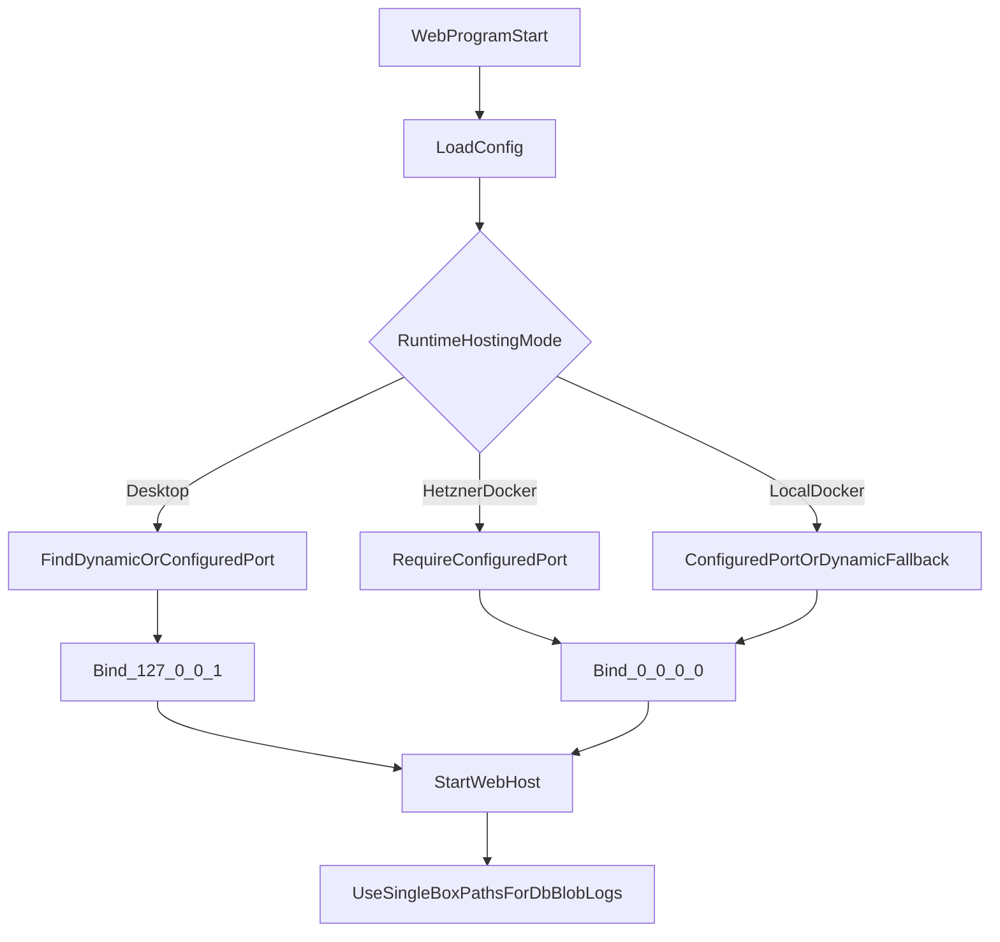

# Docker + Hetzner Deployment Plan

## Goals

- Support three runtime contexts with one config model:
  - Desktop/non-container dev (keep current dynamic localhost port behavior)
  - Local Docker dev/testing (containerized with mounted volumes)
  - Hetzner Docker deployment (explicit fixed port required)
- Keep file-based blob storage via [C:/Users/itgeorge/spark3dent/Storage/LocalFileSystemBlobStorage.cs](C:/Users/itgeorge/spark3dent/Storage/LocalFileSystemBlobStorage.cs).
- Rename outdated `DesktopConfig` naming to reflect single-box VM/local persistent storage.
- Add automated SCP + remote compose deployment flow for `ssh spark3dent-hetzner`.

## 1) Config Model Refactor

- Update [C:/Users/itgeorge/spark3dent/Configuration/Config.cs](C:/Users/itgeorge/spark3dent/Configuration/Config.cs):
  - Rename `DesktopConfig` to `SingleBoxStorageConfig` (or `SingleBoxConfig`) to indicate db/blob/log on one machine.
  - Add `RuntimeConfig` with explicit deployment mode and optional port, e.g.:
    - `HostingMode`: `Desktop | LocalDocker | HetznerDocker`
    - `Port`: nullable int
    - optional `BindAddress` (default `127.0.0.1` for Desktop, `0.0.0.0` for containers)
- Update [C:/Users/itgeorge/spark3dent/Configuration/JsonAppSettingsLoader.cs](C:/Users/itgeorge/spark3dent/Configuration/JsonAppSettingsLoader.cs) to bind only the new config shape (`SingleBox` + `Runtime`) with no legacy key support.

## 2) Initialization + Port Binding Rules

- Update defaults resolver in [C:/Users/itgeorge/spark3dent/AppSetup/AppBootstrap.cs](C:/Users/itgeorge/spark3dent/AppSetup/AppBootstrap.cs):
  - Rename `ResolveDesktopDefaults` to `ResolveSingleBoxDefaults`.
  - Keep same default path semantics for db/blob/log when empty.
- Update startup logic in [C:/Users/itgeorge/spark3dent/Web/WebProgram.cs](C:/Users/itgeorge/spark3dent/Web/WebProgram.cs):
  - Replace current `GetPort()` with mode-aware port resolution:
    - `HetznerDocker`: require configured port (`Runtime.Port` or env override), throw descriptive startup exception if missing/invalid.
    - `LocalDocker`: prefer configured/env port; fallback to current dynamic discovery if missing.
    - `Desktop`: keep current dynamic discovery behavior.
  - Bind address by mode:
    - `Desktop`: `127.0.0.1`
    - Docker modes: `0.0.0.0`
  - Keep existing browser auto-open behavior only for desktop/dev use; suppress in Docker/Hetzner modes.

## 3) Project/Container Artifacts

- Update [C:/Users/itgeorge/spark3dent/Web/Web.csproj](C:/Users/itgeorge/spark3dent/Web/Web.csproj) only as needed for container publish/runtime consistency (no behavior regressions for Chromium bundling).
- Add Docker assets:
  - [C:/Users/itgeorge/spark3dent/Web/Dockerfile](C:/Users/itgeorge/spark3dent/Web/Dockerfile) (multi-stage build/publish)
  - [C:/Users/itgeorge/spark3dent/docker-compose.local.yml](C:/Users/itgeorge/spark3dent/docker-compose.local.yml)
  - [C:/Users/itgeorge/spark3dent/docker-compose.hetzner.yml](C:/Users/itgeorge/spark3dent/docker-compose.hetzner.yml)
- Define mounted volumes for all required persistent paths:
  - database file parent directory
  - blob storage root
  - log directory
- Ensure compose files pass runtime mode + port env vars and mount `appsettings.json`/env overrides cleanly.

## 4) AppSettings and Consumer Updates

- Update appsettings consumers and defaults in:
  - [C:/Users/itgeorge/spark3dent/Web/appsettings.json](C:/Users/itgeorge/spark3dent/Web/appsettings.json)
  - [C:/Users/itgeorge/spark3dent/Cli/appsettings.json](C:/Users/itgeorge/spark3dent/Cli/appsettings.json)
  - [C:/Users/itgeorge/spark3dent/QaHarness/QaHarnessProgram.cs](C:/Users/itgeorge/spark3dent/QaHarness/QaHarnessProgram.cs)
- Replace `Desktop:*` key usage with the new `SingleBox:*` naming everywhere (no backward compatibility path).

## 5) Deployment Automation (SCP + remote compose)

- Add [C:/Users/itgeorge/spark3dent/scripts/deploy-hetzner.sh](C:/Users/itgeorge/spark3dent/scripts/deploy-hetzner.sh):
  - Build image locally (`docker build`)
  - Export image tar (`docker save`)
  - `scp` tar + compose + env/config artifacts to `spark3dent-hetzner`
  - `ssh spark3dent-hetzner` to run remote commands:
    - `docker load`
    - create/update directories/volumes
    - `docker compose -f docker-compose.hetzner.yml up -d --remove-orphans`
    - optional health/log check
- Add [C:/Users/itgeorge/spark3dent/scripts/deploy-hetzner-remote.sh](C:/Users/itgeorge/spark3dent/scripts/deploy-hetzner-remote.sh) to keep remote command block maintainable.
- Keep scripts interactive-safe for password prompt (no non-interactive auth assumptions).

## 6) Test + Validation Plan

- Update/extend tests:
  - [C:/Users/itgeorge/spark3dent/Configuration.Tests/JsonAppSettingsLoaderTest.cs](C:/Users/itgeorge/spark3dent/Configuration.Tests/JsonAppSettingsLoaderTest.cs): new section names and new required keys only.
  - [C:/Users/itgeorge/spark3dent/Web.Tests/ApiTestFixture.cs](C:/Users/itgeorge/spark3dent/Web.Tests/ApiTestFixture.cs): switch in-memory keys to new config paths; add mode/port coverage.
  - Add web startup tests for:
    - Hetzner mode + missing port => throws
    - Desktop mode + missing port => dynamic port still works
- Smoke checks:
  - local compose up/down and persistence across restart
  - Hetzner deploy script run and service accessibility on configured firewall port

## Runtime Flow (target state)

## Deliverables

- Config/runtime refactor with compatibility bridge.
- Config/runtime refactor using only the new config schema.
- Dockerfile + local/Hetzner compose files with mounted volumes.
- SCP-based Bash deployment scripts for Hetzner.
- Updated tests covering renamed config and Hetzner port requirement.

