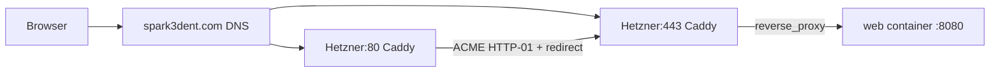

# Migrate Hetzner Deploy to Caddy + Let's Encrypt

## Current State (validated)

- Production deploy uses Docker Compose in `[C:/Users/itgeorge/spark3dent/docker-compose.hetzner.yml](C:/Users/itgeorge/spark3dent/docker-compose.hetzner.yml)`.
- App runs in `HetznerDocker` mode on port `8080` (default), bound internally via `Runtime__Port` and `Runtime__BindAddress`.
- Host currently publishes app only on loopback (`127.0.0.1:8080`), with no proxy/TLS automation in repo.
- Firewall allows only TCP `22`, `80`, `443`; domain `spark3dent.com` resolves to the Hetzner host.

## Target Architecture

## Implementation Plan

### 1) Add Caddy config and persistent certificate storage

- Create `Caddyfile` in repo (e.g. `[C:/Users/itgeorge/spark3dent/Caddy/Caddyfile](C:/Users/itgeorge/spark3dent/Caddy/Caddyfile)`) with:
  - Site blocks for `spark3dent.com` and `www.spark3dent.com`.
  - `www` -> apex redirect.
  - `reverse_proxy` to `web:8080` on the Compose network.
  - Optional baseline headers (`X-Forwarded-*` are automatic; add security headers only if desired later).
- Add persistent volumes for `/data` and `/config` so certs survive container restarts/redeploys.

### 2) Update Hetzner Compose to include Caddy front door

- Edit `[C:/Users/itgeorge/spark3dent/docker-compose.hetzner.yml](C:/Users/itgeorge/spark3dent/docker-compose.hetzner.yml)`:
  - Add `caddy` service using official `caddy:2` image.
  - Map host ports `80:80` and `443:443` on `caddy`.
  - Mount `Caddyfile`, caddy data/config volumes.
  - Put `caddy` and `web` on same default network.
  - Add `depends_on` from `caddy` to `web`.
- Keep app on `8080`, but stop publishing it externally:
  - Remove host loopback mapping (`127.0.0.1:8080:8080`) or replace with `expose: ["8080"]` so only internal Compose traffic can reach app.

### 3) Keep deploy scripts compatible with new stack

- Review/update `[C:/Users/itgeorge/spark3dent/scripts/deploy-hetzner.sh](C:/Users/itgeorge/spark3dent/scripts/deploy-hetzner.sh)` and `[C:/Users/itgeorge/spark3dent/scripts/deploy-hetzner-remote.sh](C:/Users/itgeorge/spark3dent/scripts/deploy-hetzner-remote.sh)`:
  - Ensure new Caddy assets (e.g. `Caddyfile`) are copied to remote deploy directory.
  - Ensure `docker compose up -d --remove-orphans` brings up both `web` and `caddy`.
  - Preserve existing image load flow for the app container.
- Keep `SPARK3DENT_PORT=8080` for internal app listening; this no longer requires firewall access.

### 4) Production rollout sequence on Hetzner

- Deploy updated compose + Caddy config via existing script path.
- Verify DNS for both `spark3dent.com` and `www.spark3dent.com` still points to server public IP.
- Start stack and monitor logs:
  - `caddy` logs should show ACME issuance success.
  - `web` should be reachable via Caddy upstream on internal network.
- Confirm automatic HTTP->HTTPS redirect and cert validity in browser.

### 5) Validation and operational checks

- Functional checks:
  - `http://spark3dent.com` redirects to HTTPS.
  - `https://spark3dent.com` serves app.
  - `https://www.spark3dent.com` redirects to apex.
- Security checks:
  - Port scan confirms only `22`, `80`, `443` reachable externally.
  - `8080` not reachable from public internet.
- Reliability checks:
  - Restart containers and host reboot test to ensure cert persistence.
  - Confirm renewals are managed automatically by Caddy (no certbot cron needed).

## Files Expected to Change

- `[C:/Users/itgeorge/spark3dent/docker-compose.hetzner.yml](C:/Users/itgeorge/spark3dent/docker-compose.hetzner.yml)`
- `[C:/Users/itgeorge/spark3dent/scripts/deploy-hetzner.sh](C:/Users/itgeorge/spark3dent/scripts/deploy-hetzner.sh)`
- `[C:/Users/itgeorge/spark3dent/scripts/deploy-hetzner-remote.sh](C:/Users/itgeorge/spark3dent/scripts/deploy-hetzner-remote.sh)`
- New: `[C:/Users/itgeorge/spark3dent/Caddy/Caddyfile](C:/Users/itgeorge/spark3dent/Caddy/Caddyfile)`

## Risks and Mitigations

- ACME issuance can fail if DNS/ports are misrouted -> verify A records and open inbound 80/443 before deploy.
- First deploy race where Caddy starts before app is ready -> acceptable; Caddy retries upstream automatically, and health behavior can be tightened later.
- Persistent cert storage missing -> explicitly mount caddy `/data` and `/config` volumes.

## Definition of Done

- Caddy runs in production Compose, listens on 80/443.
- Let’s Encrypt certs are automatically issued for apex + www.
- Public traffic terminates at Caddy and proxies to app on internal `8080`.
- No public access path to app port `8080` remains.

