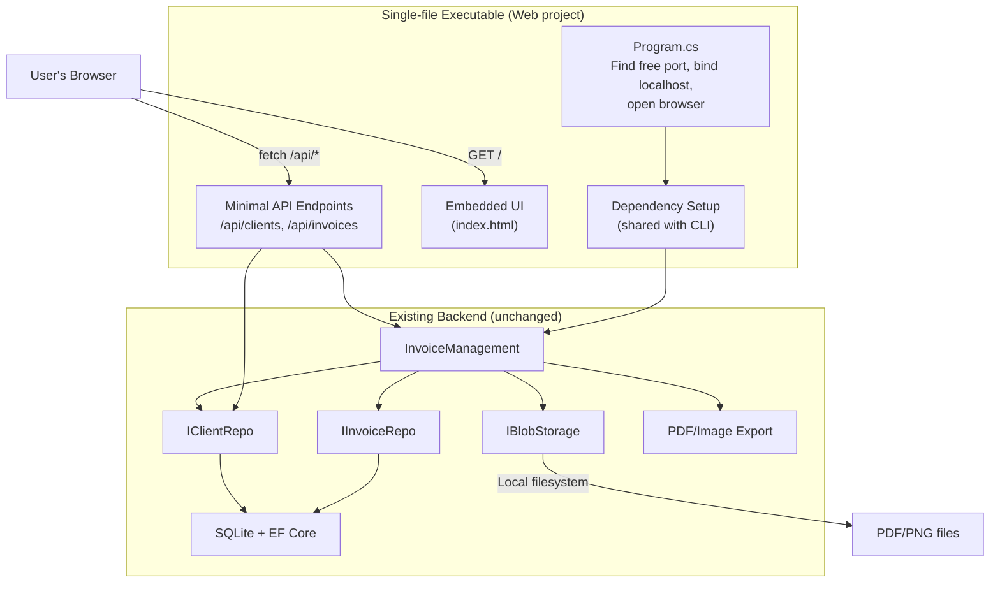

# Local MVP: Web Server + UI Wiring

## Context

The codebase already has a complete backend: domain models, SQLite persistence, PDF/image export, configuration, and logging -- all wired through [Cli/CliProgram.cs](Cli/CliProgram.cs). The UI prototype at [design/invoicer.uiprototype.v1.html](design/invoicer.uiprototype.v1.html) demonstrates the full intended user experience with mock data and mock operations.

The goal is to create a **local MVP** as a single-file executable that:

1. Runs an ASP.NET Core minimal API on a free localhost port (no LAN/network access)
2. Serves the UI as an embedded resource
3. Opens the user's default browser to the UI
4. Exposes REST API endpoints backed by the existing domain logic

This architecture (local HTTP server + browser UI) is deliberately chosen to enable a later migration to **Google Cloud Run + Postgres** for mobile/remote access, without rewriting the UI or API contract).

---

## Architecture




---

## [x] Phase 0: Project Setup

- **0.1** Create a new `Web` project directory with `Web.csproj`:
  - Target: `net9.0`, OutputType: `Exe`
  - Add NuGet: `Microsoft.EntityFrameworkCore.Design` (same version as Cli: 9.0.0)
  - Add project references: `AppSetup`, `Configuration`, `Invoices`, `Accounting`, `Database`, `Storage`, `Utilities`
  - Same Chromium bundling targets as [Cli/Cli.csproj](Cli/Cli.csproj) (copy the `BundleChromium` and `IncludeChromiumInPublish` targets)
  - Copy `appsettings.json` to output (same as Cli)
  - Configure for single-file publish: `<PublishSingleFile>true</PublishSingleFile>`, `<SelfContained>true</SelfContained>`
  - Embed the UI HTML as an embedded resource: `<EmbeddedResource Include="wwwroot\index.html" />`
- **0.2** Add `Web` project to [Spark3Dent.sln](Spark3Dent.sln)
- **0.3** Create `Web/appsettings.json` -- copy from [Cli/appsettings.json](Cli/appsettings.json) (identical config)
- **0.4** Verify the solution builds: `dotnet build Spark3Dent.sln`

**Note:** `PublishSingleFile` and `SelfContained` are conditional on `RuntimeIdentifier` so that `dotnet build` succeeds (avoids NETSDK1150 with ChromiumFetcher). Single-file publish works with `dotnet publish Web -c Release -r win-x64 --self-contained -p:PublishSingleFile=true`.

---

## [x] Phase 1: Dependency Setup (extract shared logic)

The dependency initialization in [Cli/CliProgram.cs](Cli/CliProgram.cs) lines 46-101 (`SetupDependenciesAsync`) and lines 637-678 (`LoadAndResolveConfigAsync`) should be reusable by the Web project. Rather than duplicating this logic, extract it into a shared project.

- **1.1** Create a new `AppSetup` class library project (`AppSetup/AppSetup.csproj`, target `net9.0`):
  - Add project references: `Configuration`, `Invoices`, `Accounting`, `Database`, `Storage`, `Utilities`
  - Add NuGet: `Microsoft.EntityFrameworkCore.Design` (9.0.0), `PuppeteerSharp` (21.0.1)
  - Add to [Spark3Dent.sln](Spark3Dent.sln)
- **1.2** Create `AppSetup/AppBootstrap.cs` containing:
  - `LoadAndResolveConfigAsync()` -- extracted from `CliProgram.LoadAndResolveConfigAsync` (lines 637-678). Loads config via `JsonAppSettingsLoader`, resolves default Desktop paths, writes back defaults if needed. Returns `Config`.
  - `SetupDependenciesAsync(Config config, ILogger logger)` -- extracted from `CliProgram.SetupDependenciesAsync` (lines 46-101). Creates DB context, runs migrations, creates repos/exporters/blob storage/InvoiceManagement with logging wrappers. Returns a result record with: `InvoiceManagement`, `IClientRepo`, `IInvoiceExporter` (PDF), `IInvoiceExporter` (image), `Config`.
  - `ResolveChromiumExecutablePathAsync()` -- extracted from `CliProgram` (lines 103-119).
  - `BuildContentTypeMap(...)` -- extracted from `CliProgram` (lines 121-135).
  - Helper mappers `ConfigToBillingAddress`, `ConfigToBankTransferInfo` -- extracted from `CliProgram` (lines 137-141).
- **1.3** Refactor [Cli/CliProgram.cs](Cli/CliProgram.cs) to call `AppBootstrap` instead of its own private methods. Add project reference `AppSetup` to [Cli/Cli.csproj](Cli/Cli.csproj). Verify the CLI still works: `dotnet build Cli && dotnet run --project Cli -- help`
- **1.4** In `Web/Program.cs`, use `AppBootstrap` to set up all dependencies:
  - Call `AppBootstrap.LoadAndResolveConfigAsync()` for config
  - Set up logging to `{LogDirectory}/spark3dent-web.log`
  - Call `AppBootstrap.SetupDependenciesAsync(config, logger)` for all services
  - Register the returned services for use by API endpoints (via closure capture or DI container)
- **1.5** Add project reference `AppSetup` to `Web/Web.csproj`. Verify the solution builds: `dotnet build Spark3Dent.sln`

---

## [x] Phase 1B: Invoice Correction Tracking

Add an `IsCorrected` flag to the domain model so the API can report whether an invoice has been corrected. This change touches every layer: domain record, contract tests, fake repo, DB entity, mapping, migration, and SQLite repo.

### Domain Model

- **1B.1** Add `IsCorrected` property to `Invoice` in [Invoices/Invoice.cs](Invoices/Invoice.cs):
  - Add a `bool IsCorrected` property (default `false`)
  - The `Invoice` constructor currently takes `(string number, InvoiceContent content)`. Extend it to accept an optional `bool isCorrected = false` parameter, keeping backward compatibility with all existing call sites
  - `IsCorrected` is set to `true` when an invoice is updated via `IInvoiceRepo.UpdateAsync` -- the repos are responsible for this, not the caller

### Contract Tests

- **1B.2** Update [Invoices.Tests/InvoiceRepoContractTest.cs](Invoices.Tests/InvoiceRepoContractTest.cs):
  - Update `AssertInvoicesEqual` to also compare `IsCorrected`
  - Add test: `Create_GivenValidContent_WhenCreatingInvoice_ThenIsCorrectedIsFalse` -- verify a newly created invoice has `IsCorrected == false`
  - Add test: `Update_GivenExistingInvoice_WhenUpdatingInvoice_ThenIsCorrectedIsTrue` -- create an invoice, call `UpdateAsync`, retrieve it, verify `IsCorrected == true`
  - Add test: `Update_GivenExistingInvoice_WhenUpdatingInvoiceMultipleTimes_ThenIsCorrectedRemainsTrue` -- update twice, verify still `true`
  - Add test: `Create_WhenCreatingMultipleInvoices_ThenOnlyUpdatedOneIsCorrected` -- create two, update only the first, verify first is corrected and second is not

### Fake Repo

- **1B.3** Update [Invoices.Tests/Fakes/FakeInvoiceRepo.cs](Invoices.Tests/Fakes/FakeInvoiceRepo.cs):
  - `CreateAsync`: store invoices with `IsCorrected = false` (already the default)
  - `UpdateAsync`: set `IsCorrected = true` when replacing the stored invoice: `_storage[number] = new Invoice(number, content, isCorrected: true);`
- **1B.4** Run fake repo contract tests to verify the new tests pass: `dotnet test Invoices.Tests --filter FakeInvoiceRepoTest`

### DB Entity & Mapping

- **1B.5** Add `IsCorrected` column to [Database/Entities/InvoiceEntity.cs](Database/Entities/InvoiceEntity.cs):
  - `public bool IsCorrected { get; set; }` (defaults to `false`)
- **1B.6** Update [Database/InvoiceMapping.cs](Database/InvoiceMapping.cs):
  - `ToDomain`: pass `entity.IsCorrected` to the `Invoice` constructor
  - `ApplyContent`: do **not** set `IsCorrected` here (controlled by the repo's `UpdateAsync`, not by content mapping)
  - `ToEntity`: leave `IsCorrected = false` for new entities (the default)

### Migration

- **1B.7** Confirm [Database.Tests/PendingModelChangesTest.cs](Database.Tests/PendingModelChangesTest.cs) fails (model has a new column with no migration): `dotnet test Database.Tests --filter PendingModelChangesTest` -- expect failure
- **1B.8** Add the migration: `dotnet ef migrations add AddInvoiceIsCorrected --project Database --startup-project Cli`
- **1B.9** Confirm `PendingModelChangesTest` now passes: `dotnet test Database.Tests --filter PendingModelChangesTest`

### SQLite Repo

- **1B.10** Update `UpdateAsync` in [Database/SqliteInvoiceRepo.cs](Database/SqliteInvoiceRepo.cs):
  - After `InvoiceMapping.ApplyContent(entity, content)` (line 102), add `entity.IsCorrected = true;`
  - This ensures any call to `UpdateAsync` marks the invoice as corrected

### SQLite-Specific Tests

- **1B.11** Add tests in [Database.Tests/SqliteInvoiceRepoTest.cs](Database.Tests/SqliteInvoiceRepoTest.cs):
  - `IsCorrected_GivenFreshDb_WhenCreatingInvoice_ThenIsCorrectedIsFalseInDb` -- create an invoice, query the raw `InvoiceEntity`, verify `IsCorrected == false`
  - `IsCorrected_GivenExistingInvoice_WhenUpdating_ThenIsCorrectedIsTrueInDb` -- create, update, query raw entity, verify `IsCorrected == true`
  - `IsCorrected_GivenMigratedDbWithExistingInvoices_ThenDefaultsToFalse` -- verify the migration defaults existing rows to `false` (important for production data predating this migration)

### Verify

- **1B.12** Run all tests: `dotnet test Spark3Dent.sln` -- all contract tests (fake + SQLite), migration tests, and all existing tests should pass

---

## [x] Phase 2: Server Startup & Browser Launch

- **2.1** Implement the server startup in `Web/Program.cs`:
  - Use `WebApplication.CreateBuilder()` with ASP.NET Core minimal API
  - **Bind to localhost only**: use `builder.WebHost.UseUrls($"http://127.0.0.1:{port}")` where `port` is dynamically found
  - Find a free port: bind a `TcpListener` to port 0, read the assigned port, then close the listener before starting Kestrel on that port
  - After `app.Start()` (non-blocking), open the default browser: `Process.Start(new ProcessStartInfo { FileName = url, UseShellExecute = true })`
  - Then `await app.WaitForShutdownAsync()` to keep running until Ctrl+C
  - Console output: print the URL and "Press Ctrl+C to stop"
- **2.2** Serve the UI HTML:
  - The UI file will be embedded as a resource in `Web/wwwroot/index.html`
  - Map `GET /` to return the embedded HTML with `Content-Type: text/html; charset=utf-8`
  - Use `EmbeddedResourceLoader` (from Utilities) or `Assembly.GetManifestResourceStream`

---

## [x] Phase 3: API Endpoints

All endpoints return JSON. Error responses use a consistent format: `{ "error": "message" }` with appropriate HTTP status codes.

### [x] Clients API

- **3.1** `GET /api/clients?limit={limit}` -- List clients
  - Calls `IClientRepo.ListAsync(limit)`
  - Returns: `{ "items": [{ "nickname", "name", "representativeName", "companyIdentifier", "vatIdentifier", "address", "city", "postalCode", "country" }] }`
  - Maps from `Client` domain record to JSON DTO
- **3.2** `GET /api/clients/{nickname}` -- Get a single client
  - Calls `IClientRepo.GetAsync(nickname)`
  - Returns the client DTO or 404
- **3.3** `POST /api/clients` -- Add a new client
  - Request body: `{ "nickname", "name", "representativeName", "companyIdentifier", "vatIdentifier", "address", "city", "postalCode", "country" }`
  - Validate required fields: nickname, name, representativeName, companyIdentifier, address, city, postalCode
  - Calls `IClientRepo.AddAsync(client)`
  - Returns 201 with the created client DTO, or 409 if duplicate nickname
- **3.4** `PUT /api/clients/{nickname}` -- Update an existing client
  - Request body: same fields as POST (all optional except what's being changed)
  - Calls `IClientRepo.UpdateAsync(nickname, update)`
  - Returns 200 with updated client DTO, or 404

### [x] Invoices API

- **3.5** `GET /api/invoices?limit={limit}` -- List invoices
  - Calls `InvoiceManagement.ListInvoicesAsync(limit)`
  - Returns: `{ "items": [{ "number", "date", "clientNickname", "buyerName", "totalCents", "status" }] }`
  - The `clientNickname` is derived from `BuyerAddress.Name` matching against the client list (or stored as a field if we add it)
  - The `status` field: "Issued" for all (correction tracking can be added later; for now the UI shows "EDITED" for corrected invoices based on presence of `_corrected` in the filename or a separate flag)
- **3.6** `GET /api/invoices/{number}` -- Get a single invoice
  - Calls `IInvoiceRepo.GetAsync(number)` (through InvoiceManagement or directly)
  - Returns full invoice details or 404
- **3.7** `POST /api/invoices/issue` -- Issue a new invoice
  - Request body: `{ "clientNickname": "acme", "amountCents": 12345, "date": "2026-02-20" }`
  - `date` is optional (defaults to today)
  - Calls `InvoiceManagement.IssueInvoiceAsync(nickname, amountCents, date, pdfExporter)`
  - Also exports PNG via `ReExportInvoiceAsync` if image exporter is available
  - Returns: `{ "invoice": { "number", "date", "totalCents" }, "pdfUri": "...", "pngUri": "..." }`
- **3.8** `POST /api/invoices/correct` -- Correct an existing invoice
  - Request body: `{ "invoiceNumber": "000123", "amountCents": 12345, "date": "2026-02-20" }`
  - Calls `InvoiceManagement.CorrectInvoiceAsync(number, amountCents, date, pdfExporter)`
  - Returns same shape as issue
- **3.9** `POST /api/invoices/preview` -- Preview an invoice (no persistence)
  - Request body: `{ "clientNickname": "acme", "amountCents": 12345, "date": "2026-02-20", "format": "html" }`
  - `format` is optional, defaults to `"html"`. Allowed values: `"html"`, `"png"`
  - `**format=html`** (default): Calls a new `InvoiceManagement.PreviewInvoiceHtmlAsync(nickname, amountCents, date)` method that builds the invoice and calls `InvoiceHtmlTemplate.Render(invoice)`. Returns the rendered HTML directly with `Content-Type: text/html; charset=utf-8`. This does **not** require Chromium.
  - `**format=png`**: Calls `InvoiceManagement.PreviewInvoiceAsync(nickname, amountCents, date, imageExporter)` as before. Returns `Content-Type: image/png` with the image bytes (or JSON `{ "imageDataUri": "data:image/png;base64,..." }` if preferred). Requires Chromium; returns 503 if unavailable.
  - Add `PreviewInvoiceHtmlAsync` to [Accounting/InvoiceManagement.cs](Accounting/InvoiceManagement.cs): reuses the same logic as `PreviewInvoiceAsync` (get client, determine next number, build content, create Invoice) but calls `_template.Render(invoice)` instead of going through the image exporter. Returns the HTML string.
- **3.10** `GET /api/invoices/{number}/pdf` -- Download the PDF for an invoice
  - Reads the PDF from blob storage via `IBlobStorage.OpenReadAsync("invoices", objectKey)`
  - Returns the PDF stream with `Content-Type: application/pdf` and `Content-Disposition: attachment; filename="Invoice_{number}.pdf"`

---

## [x] Phase 3B: API Integration Tests

Automated tests that exercise the running API over HTTP, verifying parameter validation, HTTP status codes, error response format, and correct response shapes. Uses `WebApplicationFactory` to spin up an in-memory test server backed by a temporary SQLite database.

### [x] Project Setup

- **3B.1** Create `Web.Tests/Web.Tests.csproj`:
  - Target: `net9.0`, `IsPackable: false`
  - NuGet: `Microsoft.AspNetCore.Mvc.Testing` (latest 9.x), `Microsoft.NET.Test.Sdk` (18.0.1), `NUnit` (4.4.0), `NUnit3TestAdapter` (6.1.0)
  - Project references: `Web`, `Utilities.Tests` (for test helpers like `CapturingLogger`)
  - Add to [Spark3Dent.sln](Spark3Dent.sln)
- **3B.2** Add `public partial class Program { }` at the bottom of `Web/Program.cs` so `WebApplicationFactory<Program>` can discover the entry point
- **3B.3** Create a `Web.Tests/ApiTestFixture.cs` base class:
  - Inherits `WebApplicationFactory<Program>`
  - Overrides `ConfigureWebHost` to:
    - Use a per-test temporary SQLite database file (unique path per test run, cleaned up on dispose)
    - Disable browser auto-open on startup (the fixture should suppress `Process.Start`)
    - Skip or mock Chromium-dependent exporters (set Chromium path to null so export returns graceful failure)
  - Provides a convenience `HttpClient` property and helper methods for common assertions (e.g., `AssertJsonError(response, expectedStatusCode)`)

### [x] Client API Tests

- **3B.4** `ClientApiTests.cs` -- test the full client lifecycle:
  - `GET /api/clients` on empty DB returns 200 with `{ "items": [] }`
  - `POST /api/clients` with valid body returns 201 and the created client DTO
  - `POST /api/clients` with duplicate nickname returns 409 with `{ "error": "..." }`
  - `POST /api/clients` with missing required field (e.g., no `name`) returns 400 with field-level error
  - `POST /api/clients` with missing `nickname` returns 400
  - `GET /api/clients/{nickname}` for existing client returns 200 with correct fields
  - `GET /api/clients/{nickname}` for non-existing client returns 404
  - `PUT /api/clients/{nickname}` with valid update returns 200 with updated fields
  - `PUT /api/clients/{nickname}` for non-existing client returns 404
  - `GET /api/clients` after adding multiple clients returns them all (verify list response shape and ordering)

### [x] Invoice API Tests

- **3B.5** `InvoiceApiTests.cs` -- test invoice operations (seed a client first in each test):
  - `GET /api/invoices` on empty DB returns 200 with `{ "items": [] }`
  - `POST /api/invoices/issue` with valid body returns 200/201 with invoice number, date, totalCents
  - `POST /api/invoices/issue` with non-existing clientNickname returns 400 or 404 with error message
  - `POST /api/invoices/issue` with negative amountCents returns 400
  - `POST /api/invoices/issue` with zero amountCents returns 400 or succeeds (match domain behavior)
  - `POST /api/invoices/issue` with missing `clientNickname` returns 400
  - `POST /api/invoices/issue` with missing `amountCents` returns 400
  - `POST /api/invoices/issue` with invalid date format returns 400
  - `GET /api/invoices/{number}` for existing invoice returns 200 with full details
  - `GET /api/invoices/{number}` for non-existing invoice returns 404
  - `POST /api/invoices/correct` with valid body returns 200 with updated invoice
  - `POST /api/invoices/correct` for non-existing invoice number returns 404
  - `GET /api/invoices` after issuing multiple invoices returns them newest-first

### [x] Preview & PDF Download Tests

- **3B.6** `InvoiceExportApiTests.cs` -- test export-related endpoints:
  - **HTML preview (no Chromium needed -- these always run):**
    - `POST /api/invoices/preview` with `format=html` (or omitted, since html is default) returns 200 with `Content-Type: text/html` and a non-empty HTML body
    - The returned HTML contains expected invoice data (invoice number, buyer name, amount) -- verify with string matching or HTML parsing
    - `POST /api/invoices/preview` with `format=html` and missing `clientNickname` returns 400
    - `POST /api/invoices/preview` with `format=html` and non-existing client returns 400/404
    - `POST /api/invoices/preview` with invalid `format` value (e.g., `"pdf"`) returns 400
  - **PNG preview (requires Chromium):**
    - `POST /api/invoices/preview` with `format=png` when Chromium is unavailable returns 503 with error message
    - (Optional, if Chromium is available in CI) `POST /api/invoices/preview` with `format=png` returns 200 with `Content-Type: image/png` and non-empty body
  - **PDF download:**
    - `GET /api/invoices/{number}/pdf` for non-existing invoice returns 404
    - `GET /api/invoices/{number}/pdf` when PDF was not exported (Chromium unavailable) returns 404 or appropriate error
    - (Optional, if Chromium is available in CI) `GET /api/invoices/{number}/pdf` returns `Content-Type: application/pdf` with non-empty body

### [x] Error Format Consistency

- **3B.7** `ErrorFormatTests.cs` -- verify all error responses follow the same shape:
  - All 400 responses contain `{ "error": "..." }` with a non-empty message
  - All 404 responses contain `{ "error": "..." }`
  - Verify the `Content-Type` is `application/json` for all error responses
  - Verify that unexpected paths (e.g., `GET /api/nonexistent`) return 404

### [x] Run

- **3B.8** Run all API tests: `dotnet test Web.Tests`

---

## [x] Phase 4: Wire the UI to the API

Transform the prototype HTML to replace mock data with real API calls. The UI will be placed in `Web/wwwroot/index.html`.

- **4.1** Copy [design/invoicer.uiprototype.v1.html](design/invoicer.uiprototype.v1.html) to `Web/wwwroot/index.html`
- **4.2** Replace mock data with API calls -- **Data loading**:
  - Remove the hardcoded `clients` and `invoices` arrays
  - Add an `async function loadClients()` that calls `GET /api/clients?limit=100` and stores the result
  - Add an `async function loadInvoices()` that calls `GET /api/invoices?limit=100` and stores the result
  - Call both on page load (`init()`) and after any mutation (add/edit client, issue/correct invoice)
  - Adapt the rendering functions (`renderInvoices`, `renderClients`) to work with the API response shape:
    - Client DTO fields: `nickname`, `name`, `representativeName`, `companyIdentifier`, `vatIdentifier`, `address`, `city`, `postalCode`, `country`
    - Invoice DTO fields: `number`, `date`, `buyerName`, `totalCents`, `status`, `clientNickname`
- **4.3** Replace mock operations -- **Client add/edit**:
  - `modalNewClientSave` click handler: call `POST /api/clients` or `PUT /api/clients/{nickname}` instead of pushing to local array
  - Show success/error toast based on response
  - Reload clients list after successful save
- **4.4** Replace mock operations -- **Invoice issue/correct**:
  - `performSave()`: call `POST /api/invoices/issue` or `POST /api/invoices/correct` depending on `editorMode`
  - Show the created invoice number in the toast
  - Reload invoices list after success
- **4.5** Replace mock operations -- **Invoice preview**:
  - Replace the mock `renderPreview()` that builds a local HTML invoice with a real API call to `POST /api/invoices/preview` with `format=html`
  - Use debouncing (already in place at 120ms) to avoid flooding the API. The HTML preview is lightweight (no Chromium, just template rendering), so 120ms is fine; adjust only if needed based on observed latency
  - Display the returned HTML inside an `<iframe>` in `#tab_preview`:
    - Add an `<iframe id="previewFrame" style="width:100%; border:none; min-height:520px;"></iframe>` to the preview body
    - On response, set `previewFrame.srcdoc = responseHtml` to render the invoice HTML
    - Auto-resize the iframe height to fit content (use `iframe.onload` to read `contentDocument.body.scrollHeight`)
  - Show a loading/spinner state inside `#tab_preview` while the request is in flight
  - Fall back to a placeholder message ("Enter client and amount to see preview") if required fields are incomplete (skip the API call entirely)
  - On API error, show the error message in `#tab_preview` instead of a broken state
  - The Details tab can remain as-is (structured JSON data built client-side from the current form values)
- **4.6** Replace mock operations -- **PDF download**:
  - The "Download PDF" button on invoice rows and in the editor should trigger a download from `GET /api/invoices/{number}/pdf`
  - Use `window.open()` or create a temporary `<a>` element with `download` attribute
- **4.7** Wire the seller address into the preview details tab:
  - Add a `GET /api/config/seller` endpoint (or include seller info in the initial page load) so the preview "SELLER" section shows real seller data instead of placeholder "Your Company Ltd"
  - Alternatively, the preview endpoint already returns a rendered image -- the details tab can show the structured data from the invoice response

---

## [x] Phase 5: Error Handling & Polish

The API tests from Phase 3B define the expected validation and error behavior. Implement validation to make those tests pass, and re-run `dotnet test Web.Tests` after each change to confirm.

- **5.1** Add global error handling middleware:
  - Catch `InvalidOperationException` (domain validation errors) and return 400 with message
  - Catch unexpected exceptions and return 500 with generic message
  - Log all errors via the existing `ILogger`
- **5.2** Add request validation on all POST/PUT endpoints:
  - Validate required fields, return 400 with specific field errors
  - Validate amount is non-negative, date format is valid
- **5.3** Add loading/error states in the UI:
  - Show a spinner or skeleton while initial data loads
  - Show error messages if API calls fail (toast with error text)
  - Disable the "Issue" / "Save correction" button while a request is in flight
  - Close the confirmation popup immediately after submitting a "Issue" / "Save correction" request (same event loop, i.e. while request in flight)

---

## [x] Phase 6: Build & Test

- **6.1** Verify the solution builds: `dotnet build Spark3Dent.sln`
- **6.2** Run all existing tests to confirm no regressions: `dotnet test Spark3Dent.sln`
- **6.3** Manual end-to-end test:
  - Run the Web project: `dotnet run --project Web`
  - Verify browser opens automatically to the correct localhost URL
  - Add a client via the UI modal
  - Issue an invoice for that client
  - Verify the invoice appears in the list
  - Verify the PDF download works
  - Correct an invoice and verify the changes
  - Verify the preview updates live as you type
  - Verify the server is not accessible from another machine on the network
- **6.4** Test single-file publish:
  - `dotnet publish Web -c Release -r win-x64 --self-contained`
  - Run the published executable and repeat the above checks

---

## Key Implementation Notes for Agents

**Before starting work on any phase:**

1. Read this plan file to check which phases/items are already completed
2. Run `dotnet build Spark3Dent.sln` to confirm the codebase is in a buildable state
3. Run `dotnet test Spark3Dent.sln` if you have modified any code referenced by tests

**After completing a phase:**

1. Mark all completed checkboxes `[x]` in this plan file
2. Run `dotnet build Spark3Dent.sln` to confirm everything still builds

**Critical files to study before implementation:**

- [Cli/CliProgram.cs](Cli/CliProgram.cs) -- dependency setup pattern (lines 46-101) and config resolution (lines 637-678)
- [Accounting/InvoiceManagement.cs](Accounting/InvoiceManagement.cs) -- all service operations and their signatures
- [Accounting/IClientRepo.cs](Accounting/IClientRepo.cs) -- client CRUD interface
- [Invoices/Invoice.cs](Invoices/Invoice.cs) -- domain model (BillingAddress, Amount, Invoice, InvoiceContent)
- [design/invoicer.uiprototype.v1.html](design/invoicer.uiprototype.v1.html) -- full UI with mock logic to adapt

**DTO mapping guidance:**

Amounts are always in cents (int). The UI converts to euros for display. Dates are ISO 8601 strings (`yyyy-MM-dd`).

**Client DTOs** -- The domain model is `Client(Nickname, Address)` where `Address` is a `BillingAddress` with 8 fields. Flatten the nested `Address` into the top level for all client endpoints (the nesting adds no value in JSON):

```json
// GET /api/clients, GET /api/clients/{nickname}, POST /api/clients, PUT response
{
  "nickname": "acme",
  "name": "ACME Consulting OOD",
  "representativeName": "John Doe",
  "companyIdentifier": "BG123456789",
  "vatIdentifier": "BG123456789",
  "address": "1 Tsarigradsko Shose Blvd",
  "city": "Sofia",
  "postalCode": "1784",
  "country": "Bulgaria"
}
```

Mapping: `nickname` = `Client.Nickname`, all other fields = `Client.Address.*` (note `BillingAddress.Name` maps to `name`, `BillingAddress.Address` maps to `address`).

**Invoice list DTO** -- For `GET /api/invoices`, flatten to summary fields only. The deeply nested `Content.BuyerAddress.Name`, `Content.Date`, and computed `TotalAmount.Cents` are pulled up to the top level:

```json
// GET /api/invoices → { "items": [...] }
{
  "number": "000128",
  "date": "2026-02-20",
  "buyerName": "ACME Consulting OOD",
  "totalCents": 123450,
  "status": "Issued"
}
```

Mapping: `number` = `Invoice.Number`, `date` = `Invoice.Content.Date`, `buyerName` = `Invoice.Content.BuyerAddress.Name`, `totalCents` = `Invoice.TotalAmount.Cents`, `status` = derived (see note below).

**Invoice detail DTO** -- For `GET /api/invoices/{number}`, return the full structure with nested objects preserved (the detail view needs all address fields, line items, and bank info):

```json
// GET /api/invoices/{number}
{
  "number": "000128",
  "date": "2026-02-20",
  "totalCents": 123450,
  "status": "Issued",
  "sellerAddress": {
    "name": "\"СМТЛ Спарк 3Дент\" ООД",
    "representativeName": "Петя Бонева",
    "companyIdentifier": "208300546",
    "vatIdentifier": null,
    "address": "ул. Мирни дни 13, ет.6, ап.17",
    "city": "Габрово",
    "postalCode": "5300",
    "country": "Bulgaria"
  },
  "buyerAddress": {
    "name": "ACME Consulting OOD",
    "representativeName": "John Doe",
    "companyIdentifier": "BG123456789",
    "vatIdentifier": "BG123456789",
    "address": "1 Tsarigradsko Shose Blvd",
    "city": "Sofia",
    "postalCode": "1784",
    "country": "Bulgaria"
  },
  "lineItems": [
    { "description": "Зъботехнически услуги", "amountCents": 123450 }
  ],
  "bankTransferInfo": {
    "iban": "BG03FINV91501017534825",
    "bankName": "FIRST INVESTMENT BANK",
    "bic": "FINVBGSF"
  }
}
```

**Invoice status mapping:** The `Invoice.IsCorrected` boolean (added in Phase 1B) maps to the `status` string in DTOs: `IsCorrected == true` → `"Corrected"`, `IsCorrected == false` → `"Issued"`. The UI shows this as the "ISSUED" / "EDITED" chip on each invoice row.

**Localhost-only binding:**

- Use `http://127.0.0.1:{port}` explicitly -- do NOT use `http://localhost:{port}` (which may resolve to `[::1]` on some systems) or `http://0.0.0.0:{port}` (which would allow LAN access).

